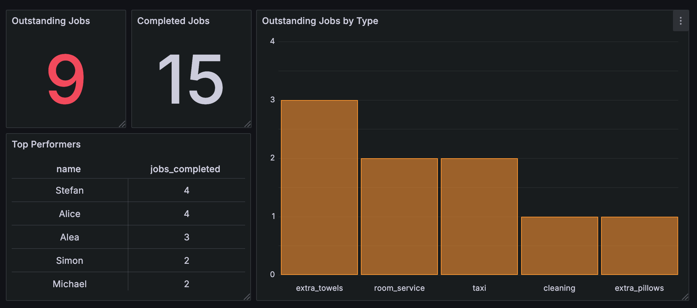

# MongoDB/CrateDB/Grafana CDC Demonstration

## Introduction

This is a small Python project that demonstrates how a CrateDB database can be populated and kept in sync with a collection in MongoDB using Change Data Capture (CDC).  Before configuring and running this project, you should watch our [video walkthrough](https://www.youtube.com/watch?v=N8n-yg3ru8I).

This project uses a hotel's front desk for its sample data.  Imagine that guests can visit the front desk, or use the phone or the hotel's app to request different service items.  Each request raises a job (for example "provide fresh towels", "call a taxi", "order room service food") that is associated with a room number.

These jobs are stored as documents in a collection in MongoDB, and are updated periodically as staff members complete them - adding a completion time and the ID of the staff member who did the work.

This data is then replicated to CrateDB for analysis and visualization in Grafana.

The project includes Python scripts to create and update jobs in MongoDB, as well as an (optional) Grafana dashboard exported as a JSON file.



## Prerequisites

To run this project you'll need to install the following software:

* Python 3 ([download](https://www.python.org/downloads/)) - we've tested this project with Python 3.12 on macOS Sequoia.
* Git command line tools ([download](https://git-scm.com/downloads)).
* Your favorite code editor, to edit configuration files and browse/edit the code if you wish.  [Visual Studio Code](https://code.visualstudio.com/) is great for this.
* Access to an instance of [CrateDB](https://console.cratedb.cloud) in the cloud.
* Access to an instance of [MongoDB](https://www.mongodb.com/cloud/atlas/register) in the cloud.
* Optional: Access to an instance of [Grafana](https://grafana.com/get/) in the cloud.

## Getting the Code

Grab a copy of the code from GitHub by cloning the repository.  Open up your terminal and change directory to wherever you store coding projects, then enter the following commands:

```bash
git clone https://github.com/crate/devrel-mongo-cdc-demo.git
cd devrel-mongo-cdc-demo
```

## Getting a CrateDB Database in the Cloud

Create a database in the cloud by first pointing your browser at [`console.cratedb.cloud`](https://console.cratedb.cloud/).

Login or create an account, then follow the prompts to create a "CRFREE" database on shared infrastructure in the cloud of your choice (choose from Amazon AWS, Microsoft Azure and Google Cloud).  

Once you've created your cluster, you'll see a "Download" button.  This downloads a text file containing a copy of your database hostname, port, username and password.  Make sure to download these as you'll need them later and won't see them again.  Your credentials will look something like this example (exact values will vary based on your choice of AWS/Google Cloud/Azure etc):

```
Host:              some-host-name.gke1.us-central1.gcp.cratedb.net
Port (PostgreSQL): 5432
Port (HTTPS):      4200
Database:          crate
Username:          admin
Password:          the-password-will-be-here
```

Wait until the cluster status shows a green status icon and "Healthy" status before continuing.  Note that it may take a few moments to provision your database.

### Database Schema Setup (CrateDB)

This demo uses two tables, `jobs` and `staff`.  The `jobs` table is created by the CDC data synchronization process.  You'll need to create the `staff` table yourself by running the following SQL statements at your CrateDB console:

```sql
CREATE TABLE staff (
  id INTEGER,
  name TEXT
);
```

```sql
INSERT INTO
  staff (id, name)
VALUES
  (1, 'Simon'),
  (2, 'Alice'),
  (3, 'Michael'),
  (4, 'Stefan'),
  (5, 'Alea');
```

## Getting a MongoDB Database in the Cloud

You'll need to create a MongoDB database in the cloud - do this for free with [MongoDB Atlas](https://www.mongodb.com/cloud/atlas/register).

Create an empty collection called `jobs` in your new MongoDB instance.

You should also create a role, a user, and configure IP access for CrateDB's CDC process.  Instructions for these steps can be found [here](https://cratedb.com/docs/cloud/en/latest/cluster/integrations/mongo-cdc.html#set-up-mongodb-atlas-authentication).

## Setting up CDC from CrateDB Cloud

The next step is to set up a CDC integration in your CrateDB Cloud cluster.  Follow our instructions [here](https://cratedb.com/docs/cloud/en/latest/cluster/integrations/mongo-cdc.html#set-up-integration-in-cratedb-cloud) to do this.

When setting up the target table, be sure to name it `jobs`, and to select `dynamic` as the object type in the dropdown.

## Editing the Project Configuration File

The Python scripts use a `.env` file to store the MongoDB connection details in.  We've provided a template file that you can copy like this:

```bash
cp env.example .env
```

Now, edit `.env` as follows:

Set the value of `MONGODB_URI` to be:

`mongodb+srv://<username>:<password>>@<hostname>/?retryWrites=true&w=majority`

replacing `<username>`, `<password>` and `<hostname>` with the values for your MongoDB Atlas cluster.

Set the value of `MONGODB_DATABASE` to be the name of the database in your MongoDB Atlas cluster.

Set the value of `MONGODB_COLLECTION` to be `jobs`.

Save your changes.

Remember, this file contains secrets... don't commit it to source control!

## Setting up a Python Environment

You should create and activate a Python Virtual Environment to install this project's dependencies into.  To do this, run the following commands:

```bash
python -m venv venv
. ./venv/bin/activate
```

Now install the dependencies that this project requires:

```bash
pip install -r requirements.txt
```

## Running the Python Code

### Job Creator Component

Run the job creator component to create new job documents in the `jobs` collection in MongoDB.  It will generate a random job, add it to the collection, then sleep for a random time before repeating the process.

```bash
python job_creator.py
```

You can stop the job creator with `Ctrl-C`.

### Job Completer Component

Run the job completer component to update existing job documents in the `jobs` collection.  This component picks the oldest outstanding job in the collection, sleeps for a while to pretend to perform the work required, then updates the job with a completion time and a randomly chosen staff ID for the staff member that completed the job.

```bash
python job_completer.py
```

You can stop the job completer with `Ctrl-C`.

To simulate constant workflow through the databases, run both the job creator and the job completer at the same time.

## Some Example SQL Queries

Once you have data flowing from MongoDB to your CrateDB cluster, you can start to run some SQL queries.  At the CrateDB console, try some of these example queries.

### How many jobs are outstanding?

```sql
select
  count(*)
from
  jobs as backlog
where
  document['completedAt'] is null;
```

### How many jobs have been completed?

```sql
select
  count(*)
from
  jobs as completed
where
  document['completedAt'] is not null;
```

### Outstanding jobs by type:

```sql
select
  document['job'] as job_type,
  count(*) as backlog
from
  jobs
where
  document['completedAt'] is null
group by
  job_type
order by
  backlog desc
```

### Average time to complete a job:

```sql
select
  round(avg(document['completedAt'] - document['requestedAt']) / 1000) as job_avg_time
from
  jobs 
where
  document['completedAt'] is not null
```

### League table of who has completed the most jobs:

```sql
select
  s.id,
  s.name,
  count(j.document) as jobs_completed
from
  staff s join jobs j on s.id = j.document['completedBy']
where
  document['completedAt'] is not null
group by
  s.id, s.name
order by
  jobs_completed desc
```

## Optional: Grafana Dashboard

The file `grafana_dashboard.json` contains an export of a [Grafana](https://grafana.com/get/) dashboard that visualizes some of the above queries. 

To use this, you'll need to sign up for a free Grafana cloud instance and connect it to your CreateDB cloud cluster using a Posgres data source (see [Grafana documentation](https://grafana.com/docs/grafana/latest/datasources/postgres/)).

## CrateDB Academy

Want to learn more about CrateDB?  Take our free online "CrateDB Fundamentals" course, available now at the [CrateDB Academy](https://cratedb.com/academy/fundamentals/).
